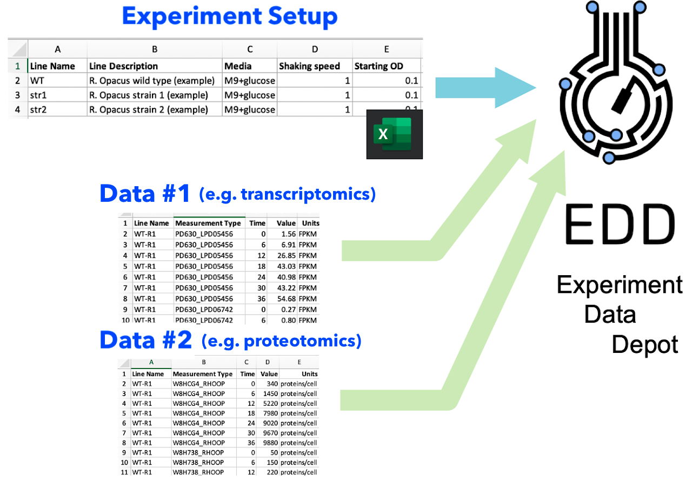
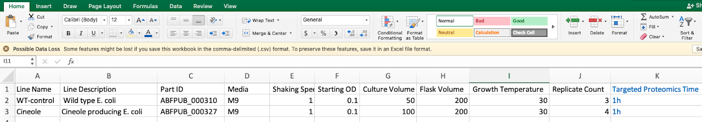
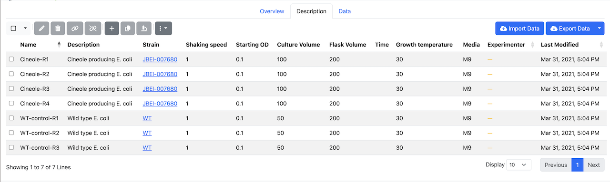
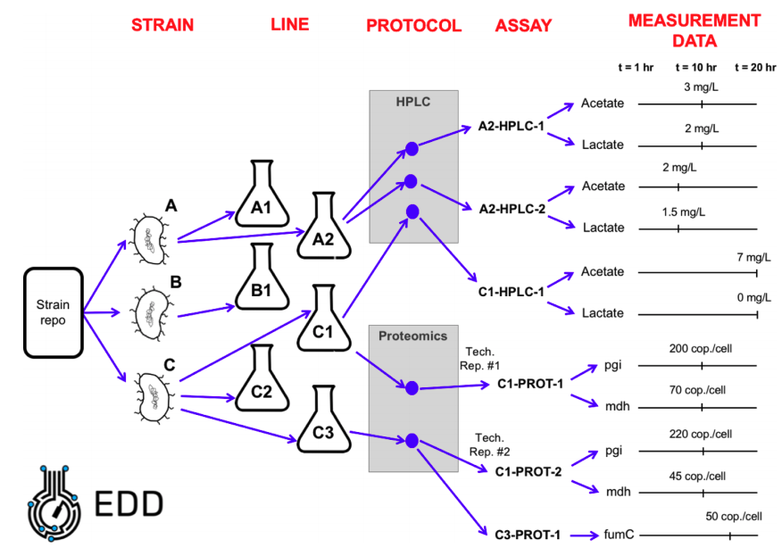

# Frequently Asked Questions

## How do I get data into EDD?

The Experiment Data Depot (EDD) **imports data in two steps**. (Fig. 1)

1. **Experiment Setup** input: this file describes your **experiment design**
   so EDD knows how to store all your data, and how it is related to your
   strains and samples.

2. **Data input**: different types of data can be added in several successive
   steps. These data input steps are independent of each other, facilitating
   the combination of different types of data (e.g. multiomics data sets).

You can find [tutorials](Tutorials.md) and protocols for [study creation][1]
and [data import][2].

<figure class="figure">
  
  <figcaption class="figure-caption">
    <strong>Fig. 1: Data input process.</strong>
    Data is imported to EDD in two phases. In the first, you import an
    Experiment Setup file, describing the details of experiment conditions.
    Afterwards, you can add as many data types--such as transcriptomics, or
    proteomics--as desired in each of the data imports.
  </figcaption>
</figure>

## What is an Experiment Setup file?

An Experiment Setup file is a **table that describes your experiment**
(Fig. 2): which strains you are using (part ID from ICE), how they are being
cultured (lines and metadata), which samples are being taken (assays) and how
they are processed (protocol). Look at Fig. 3 to see how EDD organizes your
experimental data.

The Experiment Setup file has a header row defining the layout of values in all
the following rows. There is only one required column in the header, for "name"
or "line name". The header can also have columns for:

-   "description" or "line description", to fill in a Line's description field
-   "part id" or "strain", to define identifiers or links to strains used
-   "replicate" or "replicate count" to set the number of (biological) replicates
    used for the Line definition
-   any other column can be interpreted as _metadata_

All other rows in the Experiment Setup file are used to map the columns into
records to save into EDD. The upload process will attempt to match metadata
columns to known metadata types in EDD, and add those metadata to the Line for
that row in the file.

If a metadata type cannot be matched to one in EDD automatically, a form will
be shown giving you the option to select a known metadata type to use (e.g. if
your column is "Temp.", EDD may not be able to automatically match to
"Temperature", but you can select that from the search box), or choose an
option to create a new metadata type in EDD if your account has permission to
create new metadata types, or choose an option to ignore the column.

If a piece of metadata is _Assay_ metadata, EDD will ask for the Protocol to
use for that Assay. Every Assay is defined by a Line and a Protocol, so adding
metadata to an Assay requires knowing the Protocol to use. The Experiment Setup
process will then create an Assay and assign that metadata to it.

Values in the "part id" or "strain" column will attempt to look up a matching
entry in ICE. If a matching entry cannot be found, EDD will show a search box
to map that value to a strain registry entry.

<figure class="figure">
  <em>Input in Excel:</em>
  
  <em>Import result in EDD:</em>
  
  <figcaption class="figure-caption">
    <strong>Fig. 2: Examples of Experiment Setup.</strong>
    The upper picture represents the example Experiment Setup file in Excel,
    with a line name that helps identify the culture, a description that gives
    more information on the line, the part ID in the corresponding part
    repository (public ABF in this case), different types of metadata
    (shaking speed, … growth temperature), and the number of replicates.
  </figcaption>
</figure>

## What is a line?

A "Line" in EDD is a distinct set of experimental conditions, (e.g. a
**single culture**). A Line generally corresponds to the contents of a
shake flask or well plate, though it could also be, e.g., a tube containing an
arabidopsis seed or an ionic liquid for a given pretreament. A line is not a
sample: several samples can be obtained from a single line at different times
(see Fig. 3).

A typical experiment (Fig. 3) would take strains from a repository, culture
them in different flasks (lines), apply a protocol at a given time (an assay),
and obtain different measurement data. Protocols are kept under
[protocols.io](https://protocols.io/) to enable reproducibility and better
communication. You can find the [LBNL repository here][3].

<figure class="figure">
  
  <figcaption class="figure-caption">
    <strong>Fig. 3: EDD data organization (ontology).</strong>
    In this example, we have three different strains (A, B, and C). Strain A is
    cultured in two different flasks, giving rise to two lines (A1 and A2).
    Strain B is cultured in a single flask, giving rise to a single line B1.
    Strain C is cultured in three flasks, giving rise to three lines: C1, C2
    and C3. Line A2 is assayed through HP-LC (protocol) at times t = 10hr
    (assay A2-HPLC-1) and t = 8hr (assay A2-HPLC-2). Assay A2-HPLC-1 produces
    two measurements: 3 mg/L of Acetate and 2 mg/L of Lactate. Assay A2-HPLC-2
    produces two measurements: 2 mg/L of Acetate and 1.5 mg/L of Lactate.
  </figcaption>
</figure>

## How do I choose good line names?

A good way to name your lines involves the strain name, culture conditions and
whichever other condition is being changed in the experiment. For example,
WT-LB-70C would indicate is a wild type, grown on LB at 70º C (imagine you are
trying different growth temperatures). Cineole-EZ-50C indicates a cineole
producing strain, grown on EZ at 50º C … etc.

## Why should I use the Experiment Data Depot?

The Experiment Data Depot (EDD) is a standardized **repository of experimental
data**. This is useful for the following reasons:

-   EDD provides a **single point of storage for your experimental data**, to be
    easily referenced. Instead of providing a collection of spreadsheets
    organized in an adhoc manner in the supplementary material of your paper,
    you can give a single URL where your readers can find all the data in a
    format that is always the same. This will make your papers more likely to be
    cited. In the same way that storing your strain information in the
    [Inventory of Composable Elements (ICE)][4] will make it easier to access
    and more likely to be cited.

-   **Easily collate different types of multiomics data.** Comparing the results
    of phenotyping a cell using transcriptomics, proteomics and metabolomics
    can be complicated. EDD facilitates this task with the use of a standard
    vocabulary for genes, proteins and metabolites, solving the problem of
    [leveraging multiomics data][5].

-   **EDD facilitates data analysis.** By using a standard data format through
    EDD, you can leverage previously created Jupyter notebooks to easily do
    your calibrations and statistics (e.g. calcualte error bars).

-   **Enable Advanced Learn techniques.** EDD helps you interact with data
    scientists to use [Machine Learning and Artificial Intelligence techniques][6]
    to effectively [guide metabolic engineering][7]. Just give them the link of
    your study and you will save them the wrangling of spreadsheets that
    [consumes 50-80% of their time][8].

## Why can't I see the data in the link?

You may not have the correct permissions to view the Study. Ask the person who
sent you the link to give you read permissions.

## What is a slug?

A slug is a way to identify a Study in links in a more easily readable form.
Using a slug allows for links to look like the below, with slug `pcap`:

<pre>https://public-edd.jbei.org/s/pcap/overview/</pre>

Instead of using a link to the same study that looks like this:

<pre>https://public-edd.jbei.org/study/2843/overview/</pre>

---

[1]: https://www.protocols.io/private/61BBCC7D4ED711EBA9620A58A9FEAC2A
[2]: https://www.protocols.io/private/8F0C1D367AC3E79B36411246AD0E4822
[3]: https://www.protocols.io/file-manager/BD7998C47D2A4742B22279101C23D26C
[4]: https://academic.oup.com/nar/article/40/18/e141/2411080
[5]: https://www.nature.com/articles/s41597-019-0258-4
[6]: https://www.nature.com/articles/s41467-020-18008-4
[7]: https://www.nature.com/articles/s41467-020-17910-1
[8]: https://www.nytimes.com/2014/08/18/technology/for-big-data-scientists-hurdle-to-insights-is-janitor-work.html
